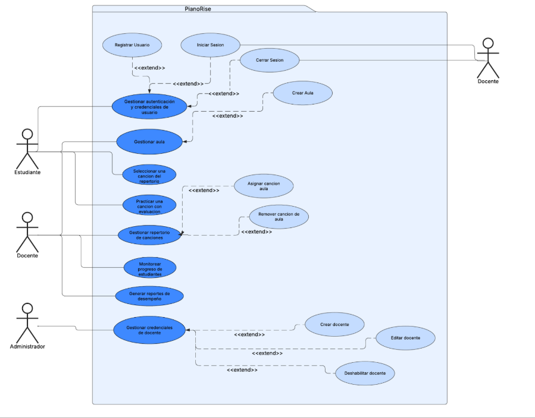

[comment]: 

**UNIVERSIDAD PRIVADA DE TACNA**

**FACULTAD DE INGENIERÍA**

**Escuela Profesional de Ingeniería de Sistemas**

**Plataforma Web Interactiva para el Aprendizaje Autónomo del Piano con Reconocimiento de Notas en Tiempo Real \- PianoRise**

Curso: Patrones de Software

Docente: *Mag. Patrick Cuadros Quiroga*

Integrantes:

 ***Agreda Ramirez, Jesús Eduardo 	(2021069823)***  
***Contreras Lipa, Alvaro Javier    (2021070020)***  
***Ortiz Fernandez, Ximena Andrea 	(2021071080)***

**Tacna – Perú**  
**2025**

---

**Plataforma Web Interactiva para el Aprendizaje Autónomo del Piano con Reconocimiento de Notas en Tiempo Real \- PianoRise**

**Documento de Arquitectura de Software**

**Versión *1.0***

| CONTROL DE VERSIONES |  |  |  |  |  |
| :---: | :---: | :---: | :---: | :---: | ----- |
| Versión | Hecha por | Revisada por | Aprobada por | Fecha | Motivo |
| 1.0 |  |  |  | 29/03/2025 | Versión Original |

---

**ÍNDICE GENERAL**

[1\. Introducción	4](#introducción)

[1.1. Propósito	5](#propósito)

[1.2. Alcance	6](#alcance)

[1.3. Definiciones, Siglas y Abreviaturas	7](#definiciones,-siglas-y-abreviaturas)

[1.4. Visión General	8](#visión-general)

[2\. Representación Arquitectónica	8](#representación-arquitectónica)

[2.1. Escenarios	8](#escenarios)

[2.2. Vista Lógica	9](#vista-lógica)

[2.3. Vista del Proceso	10](#vista-del-proceso)

[2.4. Vista de desarrollo	28](#vista-de-desarrollo)

[2.5. Vista Física	29](#vista-física)

[3\. Objetivos y Limitaciones Arquitectónicas	29](#objetivos-y-limitaciones-arquitectónicas)

[3.1. Disponibilidad	29](#disponibilidad)

[3.2. Seguridad	30](#seguridad)

[3.3. Adaptabilidad	30](#adaptabilidad)

[3.4. Rendimiento	30](#rendimiento)

[4\. Análisis de Requerimientos	31](#análisis-de-requerimientos)

[4.1. Requerimientos funcionales	31](#requerimientos-funcionales)

[4.2. Requerimientos no funcionales	35](#requerimientos-no-funcionales)

[5\. Vistas de Caso de Uso	36](#heading=h.wh1otg33i288)

[6\. Vista Lógica	42](#vista-lógica-1)

[6.1. Diagrama Contextual	42](#diagrama-contextual)

[7\. Vista de Procesos	43](#vista-de-procesos)

[7.1. Diagrama de Proceso Actual	43](#diagrama-de-proceso-actual)

[7.2. Diagrama de Proceso Propuesto	44](#diagrama-de-proceso-propuesto)

[8\. Vista de Despliegue	45](#vista-de-despliegue)

[8.1. Diagrama de Contenedor	45](#diagrama-de-contenedor-\(link-del-diagrama\))

[9\. Vista de Implementación	45](#vista-de-implementación)

[9.1. Diagrama de Componentes	45](#diagrama-de-componentes)

[10\. Vista de Datos	47](#vista-de-datos)

[10.1. Diagrama Entidad Relación	47](#diagrama-entidad-relación)

[11\. Calidad	48](#calidad)

[11.1. Escenario de Seguridad	48](#escenario-de-seguridad)

[11.2. Escenario de Usabilidad	48](#escenario-de-usabilidad)

[11.3. Escenario de Adaptabilidad	49](#escenario-de-adaptabilidad)

[11.4. Escenario de Disponibilidad	50](#escenario-de-disponibilidad)

[11.5. Otro Escenario	51](#otro-escenario)

---

## **Documento de Arquitectura de Software**

# 1. Introducción

El presente Documento de Arquitectura de Software para **PianoRise** tiene como objetivo principal proporcionar una visión detallada y estructurada de la arquitectura y el diseño del sistema. PianoRise no es solo una plataforma educativa; es una iniciativa tecnológica pensada para transformar la forma en que los estudiantes de piano desarrollan sus habilidades, mediante la práctica autónoma, el seguimiento del progreso y la interacción en un entorno guiado por docentes.

Este sistema ha sido diseñado para atender varios desafíos clave en la enseñanza y aprendizaje musical: la falta de retroalimentación inmediata durante la práctica individual, la necesidad de llevar un historial de desempeño preciso, y la gestión efectiva de aulas virtuales por parte de los docentes. PianoRise busca ofrecer un espacio donde el estudiante pueda practicar piezas musicales con evaluación automática en tiempo real, mientras los docentes supervisan el avance de sus alumnos.

Este documento está orientado a ofrecer una guía clara y comprensible para todos los desarrolladores y partes interesadas, detallando la organización general del sistema, los componentes principales, los módulos que lo integran, y las interacciones entre ellos. Se incluyen diagramas UML y de flujo que representan los procesos fundamentales del software, permitiendo que cada parte del sistema esté bien documentada y pueda comprenderse con facilidad.

Al ofrecer una visión integral de la arquitectura de PianoRise, este documento facilita la colaboración y el entendimiento entre todos los integrantes del equipo de desarrollo. El objetivo es asegurar que el sistema se implemente de manera sólida, escalable y alineada con los objetivos pedagógicos, brindando una plataforma robusta para la enseñanza y práctica del piano.

---

  ## 1.1. Propósito

  El objetivo principal de **PianoRise** es ofrecer una solución digital innovadora que facilite el aprendizaje del piano tanto de forma autónoma como en entornos educativos presenciales. Utilizando tecnologías interactivas como el reconocimiento de audio y la retroalimentación continua, la plataforma optimiza la experiencia del usuario y fomenta un aprendizaje progresivo y motivador.

  PianoRise está diseñado para apoyar a estudiantes que se inician en el mundo musical, proporcionando un entorno práctico, accesible y didáctico, sin requerir conocimientos previos en teoría musical. Su enfoque combina la autoformación con el acompañamiento en clase, permitiendo a los alumnos avanzar a su propio ritmo mientras reciben guía y seguimiento de sus docentes.

  Los propósitos específicos del sistema son:

  - Brindar una herramienta intuitiva y accesible para el aprendizaje del piano en contextos de educación formal y autoformación.
  - Utilizar reconocimiento de audio para detectar las notas tocadas por el usuario y compararlas con las notas esperadas.
  - Implementar un sistema de avance gradual basado en la precisión de ejecución, mediante un esquema de progreso fraccionado.
  - Presentar ejercicios interactivos y canciones sencillas que fomenten la motivación y la práctica constante.
  - Apoyar a los docentes en la supervisión del progreso de los alumnos, facilitando el seguimiento individualizado del aprendizaje musical.

  Con este enfoque, PianoRise busca modernizar la enseñanza del piano en instituciones educativas como la *Institución Educativa Privada Verdad y Vida – Veritas et Vita*, ofreciendo una experiencia pedagógica más dinámica, efectiva y adaptada a las necesidades del alumnado.

---

2. #### Alcance

      El presente sistema tiene como alcance el desarrollo e implementación de la plataforma web PianoRise, orientada al aprendizaje autónomo del piano para estudiantes de nivel escolar. El sistema estará enfocado en ofrecer funcionalidades prácticas que permitan la interacción directa del estudiante con ejercicios musicales y retroalimentación inmediata, así como el seguimiento del progreso por parte de los docentes. A continuación se detallan las inclusiones y exclusiones del sistema.

      ##### Inclusiones

      **Desarrollo de una Plataforma Web:**  
      - Creación de una plataforma accesible desde navegadores modernos (Chrome, Firefox, Edge), con una interfaz gráfica intuitiva y moderna.

      **Funcionalidades Clave:**

      - **Gestión de usuarios:**
        - Registro seguro de estudiantes y docentes mediante credenciales.
        - Inicio y cierre de sesión con autenticación segura.
        - Edición de perfil por parte del usuario.
        - Gestión de cuentas docentes por el administrador.

      - **Reconocimiento de notas en tiempo real:**
        - Captura y procesamiento de audio desde el micrófono.
        - Detección y comparación de notas tocadas vs. notas esperadas.
        - Retroalimentación inmediata sobre la precisión.

      - **Repertorio de canciones:**
        - Administración de un repertorio de canciones por parte del administrador.
        - Selección de canciones por docentes para asignarlas a sus aulas.
        - Acceso por parte del estudiante a las canciones asignadas para práctica.

      - **Retroalimentación visual y auditiva:**
        - Indicaciones visuales para notas correctas e incorrectas.
        - Señales sonoras de confirmación o error.

      - **Gestión del aula:**
        - Creación de aulas por parte de los docentes.
        - Asignación de repertorios a cada aula.
        - Generación de códigos únicos para que los estudiantes se unan.

      - **Almacenamiento de progreso de los estudiantes:**
        - Registro de canciones completadas satisfactoriamente.
        - Almacenamiento de errores cometidos por canción finalizada.

      - **Monitoreo de progreso para docentes:**
        - Visualización del avance de cada estudiante.
        - Detalle de canciones completadas, puntajes y errores.

      - **Generación de reportes de desempeño:**
        - Creación de reportes con métricas y gráficos por aula.
        - Posibilidad de descargar o visualizar los reportes para seguimiento académico.

      **Soporte Tecnológico:**  
      - Uso de bibliotecas especializadas como Librosa para el procesamiento de audio y detección de notas en tiempo real.

      ##### Exclusiones

      - **Compatibilidad móvil:**  
        El sistema estará disponible solo para plataformas web. No se desarrollarán apps móviles nativas.

      - **Instrumentos adicionales:**  
        El enfoque del sistema estará limitado exclusivamente al piano.

      - **Evaluación avanzada:**  
        No se incluirán evaluaciones de velocidad, ritmo o teoría musical compleja.

      - **Integración con plataformas externas:**  
        No se contemplan integraciones con APIs educativas ni plataformas musicales de terceros.

---

  3. #### **Definiciones, Siglas y Abreviaturas**

---

  4. #### **Visión General**

 ---

2. #### Representacion Arquitectonica

   1. ## **Escenarios** {#escenarios}

      El diagrama de casos de uso de PianoRise muestra las interacciones entre los diferentes actores y las funcionalidades del sistema. Donde los actores principales son el Administrador y Estudiante.

  

**Diagrama 01\.** Diagrama de Casos de Uso de la Plataforma Web PianoRise  

